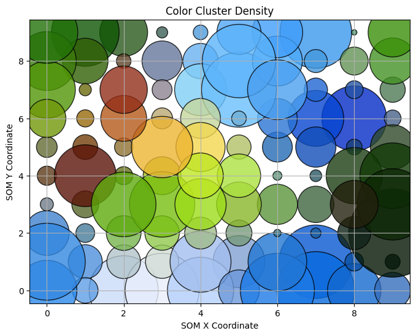

# Image Color Clustering using Self-Organizing Maps (SOM)

## 🚀 Why I Made This Project

I wanted to explore **unsupervised learning** and understand how **Self-Organizing Maps (SOM)** can be used to cluster colors in an image. This project helped me visualize how a **neural network-based clustering algorithm** can categorize pixels based on color similarity.

## 📚 What I Learned

- How **Self-Organizing Maps (SOMs)** work and their application in clustering.
- How to preprocess and normalize image data for machine learning models.
- How to use **tqdm** to track the progress of pixel clustering.
- How to visualize the **distribution of dominant colors** in an image.

## Goals of This Project

1. **Apply Self-Organizing Maps (SOM) to an image** to group similar colors.
2. **Maintain the quality of the original image** while generating a clustered version.
3. **Analyze color clusters** using a **color density plot** to understand dominant shades.
4. **Iterate over training steps** to observe how the clustering changes over time.

## Results and Visualizations

### **Original vs. Quantized Image**
| Original Image | Quantized Image |
|---------------|----------------|
|  |  |

### **Color Density Distribution**
This plot shows how frequently each color appears in the image.

## What Could Be Improved?

While the SOM model works well for clustering, there are some areas for improvement:
- **Optimization of SOM Parameters**: Adjusting the **grid size, learning rate, and training steps** could improve clustering.
- **Reducing Computational Complexity**: The current method processes each pixel separately, which can be slow for high-resolution images.
- **Better Quantization Methods**:
  - **K-Means Clustering**: Faster and often provides **sharper results** for color quantization.
  - **Gaussian Mixture Models (GMM)**: Can **model color distributions more accurately** compared to SOM.
  - **DBSCAN**: Could be useful to detect dominant color regions **without predefined cluster sizes**.

## Possible Algorithmic Enhancements

| Algorithm | Pros | Cons |
|-----------|------|------|
| **Self-Organizing Maps (SOM)** | Preserves topological structure of colors | Computationally expensive |
| **K-Means Clustering** | Fast and simple | Requires specifying number of clusters |
| **Gaussian Mixture Models (GMM)** | Can model complex distributions | More computationally intensive |
| **DBSCAN** | Detects arbitrary-shaped clusters | Struggles with dense, overlapping colors |

